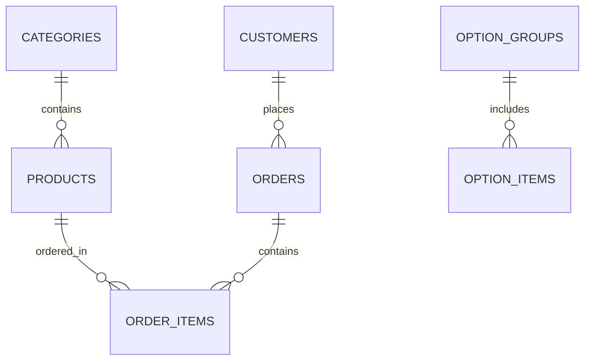

# 📖 O Ses Çiğköfte POS Sistemi - Kurulum & Veritabanı Rehberi

Bu doküman, **O Ses Çiğköfte POS & Adisyon Uygulaması**'nın müşteri (bayi) bilgisayarına (Windows Dokunmatik Kasa veya macOS) nasıl kurulacağını, yerel ağda personele nasıl yayınlanacağını ve veritabanının nerede durup neleri içerdiğini adım adım açıklar.

---

## 🚀 1. Müşteri Bilgisayarına Kurulum Rehberi

Uygulama **sıfır harici sunucu bağımlılığına** sahiptir. Tek bir bilgisayar (Kasa) sunucu görevi görür ve dükkandaki diğer cihazlar (personel telefonları, tabletler) Wi-Fi üzerinden kasaya bağlanır.

### 📋 Ön Gereksinimler
- **İşletim Sistemi:** Windows 10/11 (Dokunmatik Kasa PC) veya macOS.
- **Python:** Python 3.9 veya daha yeni bir sürüm ([python.org](https://www.python.org/downloads/) adresinden indirebilirsiniz). *Windows kurulumunda "Add Python to PATH" seçeneğini işaretlemeyi unutmayın.*
- **İnternet / Ağ:** Dükkanda kasayı ve personel telefonlarını bağlayan bir Wi-Fi modemi / yerel ağ.

---

### 💻 Adım Adım Kurulum

#### Windows Dokunmatik Kasa Kurulumu:
1. Proje klasörünü kasadaki istediğiniz bir yere kopyalayın (Örn: `C:\OsesPOS`).
2. Klasör içindeki **`run_windows.bat`** dosyasına çift tıklayın.
   - Script otomatik olarak Python sanal ortamını (`venv`) kuracak, gerekli kütüphaneleri yükleyecek ve POS sunucusunu başlatacaktır.
3. Kasa bilgisayarında taranan adres: `http://localhost:8000`

#### Windows Açılışında Otomatik Başlatma (Otomatik Kasa):
Müşteri bilgisayarı her açıldığında POS sisteminin otomatik başlaması için:
1. `Win + R` tuşlarına basıp `shell:startup` yazın ve Enter'a basın.
2. `run_windows.bat` dosyasının kısayolunu bu klasör içine yapıştırın.
3. Artık kasa bilgisayarı elektrik kesintisinde veya yeniden başladığında POS sistemi otomatik açılacaktır.

#### Dokunmatik Tam Ekran Modu (Chrome Kiosk Modu):
Kasa ekranının tam ekran uygulama gibi açılması için Google Chrome kısayol hedefinin sonuna şu parametreyi ekleyin:
```cmd
"C:\Program Files\Google\Chrome\Application\chrome.exe" --kiosk http://localhost:8000 --kiosk-printing
```
*`--kiosk-printing` parametresi sayesinde yazdırma butonuna basıldığında yazıcı diyaloğu beklemeden 80mm termal fişi anında çıkartır.*

---

## 📱 2. Müşteri Karekod (QR) Self-Ordering & Masadan Sipariş

Müşterilerin dükkandaki masalardan veya kuyrukta beklerken kendi cep telefonlarıyla sipariş vermesini sağlar.

### 🔗 Ömür Boyu Sabit QR Adresleri (Vercel Akıllı Yönlendirici - 0 TL)
- **Sabit Masa QR Adresi:** `https://oses-pos.vercel.app/qr?masa=Masa1` *(Masalardaki bu adres HİÇBİR ZAMAN DEĞİŞMEZ)*
- **İnternet / 4G-5G Erişimi:** Müşteriler dükkan Wi-Fi'ına bağlanmadan kendi 4G/5G internetiyle 0.05 saniyede kasaya yönlendirilir.

### 🖨️ Kasada Otomatik Fiş Basım Mekanizması
- Müşteri kendi telefonundan *"Siparişi Ver"* butonuna bastığı an, kasadaki POS ekranı **3 saniye içinde sesli uyarı verir** (`🔔 YENİ KAREKOD SİPARİŞİ GELDI!`).
- Fiş 80mm termal yazıcıdan **hiçbir butona basılmadan otomatik olarak basılır**.

### 🖼️ Kasa İçinden Masa Etiketlerini Toplu Bastırma
- Kasa POS ekranında sağ üstteki **`📱 Karekod (QR) Menü`** butonuna basarak dükkan masalarına (Masa 1 - Masa 10) yapıştırılacak sabit etiketlerin çıktısını tek tıkla alabilirsiniz.

---

## 📱 3. Personel Telefonlarından Wi-Fi Bağlantısı

Kasada açılan POS sistemine dükkandaki tüm garson veya tezgah personeli cep telefonlarından veya tabletlerden erişebilir.

1. **Kasa Bilgisayarının Yerel IP Adresini Bulun:**
   - Windows Komut Satırına (cmd) `ipconfig` yazın. (Örn: `192.168.1.100`)
2. **Personel Telefonlarını Aynı Wi-Fi Ağına Bağlayın.**
3. **Telefonun Tarayıcısını Açın:**
   - Adres satırına kasanın IP adresini ve portunu yazın:
     `http://192.168.1.100:8000`
4. **Ana Ekrana Ekle (PWA / App Deneyimi):**
   - Safari veya Chrome menüsünden **"Ana Ekrana Ekle (Add to Home Screen)"** seçeneğini tıklayarak mobil uygulama gibi ikon oluşturabilirsiniz.

---

## 💾 3. Veritabanı (DB) Nerede Duracak ve Nasıl Çalışır?

### 📍 DB Dosyasının Konumu
Veritabanı, projenin kök dizininde bulunan **`oses_pos.db`** isimli **SQLite3** dosyasında durmaktadır.

- **Windows:** `C:\OsesPOS\oses_pos.db`
- **macOS:** `/Users/denizli/Desktop/oses/oses_pos.db`

### 🔒 Veritabanı Mimari Avantajları
1. **İnternet Kesilse Bile Durmaz:** Tüm veriler tamamen yerel diskte durur. İnternet olmasa dahi satış ve adisyon basımı durmaz.
2. **WAL (Write-Ahead Logging) Modu:** Çoklu cihaz aynı anda sipariş girdiğinde kilitlenme yapmaz, milisaniye hızında çalışır.
3. **Saniyeler İçinde %100 Yedekleme:** Dükkan sahibi `oses_pos.db` dosyasını bir USB belleğe veya Google Drive / OneDrive klasörüne kopyalayarak tüm müşteri kayıtlarını, menüyü ve geçmiş satış raporlarını anında yedekleyebilir.

---

## 🗄️ 4. Veritabanında (DB) Hangi Veriler Saklanır?

`oses_pos.db` veritabanı 7 temel tablodan oluşur:



### 📋 Tablo Detayları ve Saklanan Bilgiler:

#### 1. `customers` (Müşteri Kayıt Defteri)
Kayıtlı tüm müşterilerin bilgileri ve sipariş geçmişi istatistikleri durur.
- `phone` (PRIMARY KEY): Müşteri telefon numarası (05XXXXXXXXX).
- `name`: Müşteri adı ve soyadı.
- `address`: Açık teslimat adresi.
- `notes`: Özel sipariş ve kurye notları (Örn: "Zile basmayın").
- `total_orders`: Müşterinin toplam sipariş sayısı.
- `created_at` / `updated_at`: Kayıt ve güncelleme zamanları.

#### 2. `categories` (Menü Kategorileri)
Menünün ana gruplarını tutar.
- `id`: Kategori ID'si.
- `name`: Kategori adı (*Çiğ Köfteler, İçecekler, Tatlılar, Ekstralar & Soslar*).
- `icon`: Kategori emojisi/simgesi.
- `sort_order`: Sıralama önceliği.

#### 3. `products` (Ürün Listesi & Fiyatlar)
Menüdeki tüm çiğ köfte paketleri, dürümler, içecek ve tatlılar saklanır.
- `id`: Ürün ID'si.
- `category_id`: Bağlı olduğu kategori.
- `name`: Ürün adı (*Örn: DÜBLE DÜRÜM, ORTA PAKET*).
- `description`: Ürün içeriği ve açıklaması.
- `price`: Resmi O Ses menü satış fiyatı (TL).
- `unit`: Birim türü (*Adet, Paket, Şişe, Porsiyon*).
- `image_symbol`: Görsel simge (*🌯, 🥗, 🥛*).
- `is_active`: Aktiflik durumu (1: Satışta, 0: Pasif).
- `has_options`: Opsiyon seçimi olup olmadığı.

#### 4. `option_groups` (Opsiyon Grupları & Kurallar)
Çiğ köfte seçim grupları ve ilave ücret kuralları saklanır.
- `id`: Grup ID'si.
- `name`: Grup adı (*🔥 ACI SEVİYESİ, 🥬 YEŞİLLİK & GARNİTÜR, 🍾 SOS & EKSTRALAR*).
- `type`: Seçim türü (`SINGLE`: Tekli, `MULTIPLE`: Çoklu).
- `free_limit`: Ücretsiz sunulan miktar (Örn: Yeşillik için ilk 4 adet ücretsiz).
- `extra_fee`: Limiti aşan her ilave garnitür ücreti (Örn: Limiti aşan her malzeme +₺10.00).

#### 5. `option_items` (Opsiyon Elemanları & Ücretli Ekstralar)
Grupların altındaki malzemeler ve özel fiyat farkları saklanır.
- `id`: Eleman ID'si.
- `group_id`: Bağlı olduğu opsiyon grubu.
- `name`: Malzeme adı (*Marul, Maydanoz, Nane, Turşu, Çift Lavaş, Doritos İlavesi*).
- `extra_price`: Özel fiyat farkı (Örn: Çift Lavaş +₺15.00, Doritos +₺20.00).
- `is_default`: Varsayılan seçili gelip gelmeyeceği.

#### 6. `orders` (Adisyon & Sipariş Geçmişi)
Tamamlanan tüm satışların ana bilgileri tutulur.
- `id`: Benzersiz Adisyon ID'si.
- `order_number`: Günlük sırayla artan adisyon fiş numarası (#1, #2, #3...).
- `customer_phone` / `customer_name`: Müşteri bilgileri.
- `source`: Sipariş kanalı (`KASA`, `TRENDYOL`, `GETIR`, `MIGROS`).
- `payment_method`: Ödeme yöntemi (`NAKIT`, `KREDI_KART`, `VERESIYE`).
- `subtotal`: Brüt sepet tutarı.
- `discount_type`: Uygulanan indirim türü (`PERCENT`, `TL`, `IKRAM`, `NONE`).
- `discount_amount`: Yapılan indirim tutarı (TL).
- `total_amount`: Kasaya giren **Net Ciro** tutarı.
- `created_at`: Satışın gerçekleştiği kesin tarih ve saat.

#### 7. `order_items` (Adisyon Kalem Detayları)
Siparişin içindeki her bir ürün ve müşterinin seçtiği malzemeler tutulur.
- `id`: Kalem ID'si.
- `order_id`: Bağlı olduğu adisyon.
- `product_id` / `product_name`: Satılan ürün bilgisi.
- `unit_price`: Satış anındaki birim fiyat.
- `quantity`: Adet.
- `options_summary`: Seçilen tüm opsiyonların özeti (*Örn: "Orta Acılı, Marul, Turşu, Çift Lavaş (+₺15.00)"*).
- `total_price`: Satır toplam tutarı.

---

## 🖨️ 5. Termal Fiş Yazıcısı (80mm) Kurulumu

1. 80mm USB Termal Yazıcıyı kasanın USB portuna takın ve Windows sürücüsünü (Driver) yükleyin.
2. Windows Ayarlarında yazıcıyı **Varsayılan Yazıcı (Default Printer)** olarak ayarlayın.
3. Kasa Chrome tarayıcısında uygulamayı açıp siparişi tamamladığınızda sistem otomatik olarak 80mm standart fiş formatında adisyon çıktısını yazıcıya gönderecektir.

---

### 🛡️ Müşteriye Teslim Öncesi Kontrol Listesi (Checklist)
- [x] Python 3.9+ yüklü ve PATH'e ekli.
- [x] `run_windows.bat` Başlangıç (Startup) klasörüne eklendi.
- [x] Kasa IP adresi sabitlendi ve personel telefonlarına kısayol oluşturuldu.
- [x] 80mm termal yazıcı varsayılan seçildi.
- [x] Veritabanı `oses_pos.db` dosyasının yedeği alındı.
